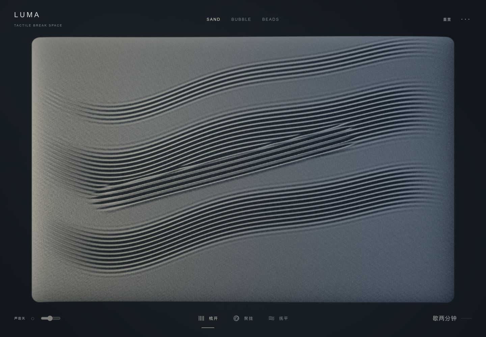
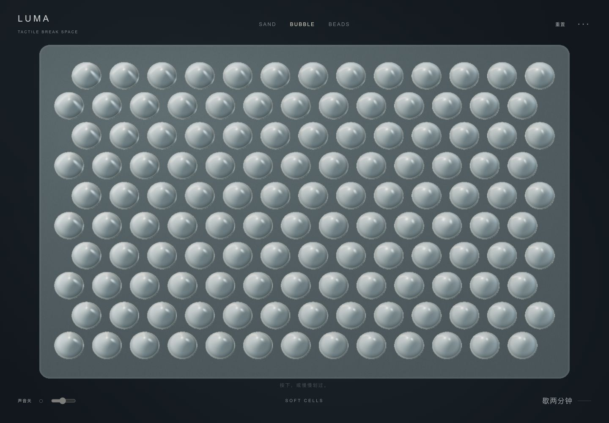
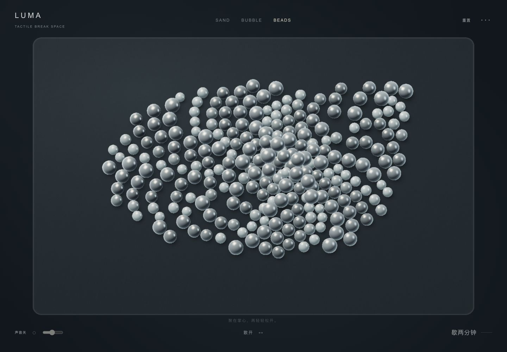

# LUMA — Tactile Break Space

**[在线体验 / Play LUMA →](https://xiaoxi1892.github.io/LUMA/)** · [GitHub](https://github.com/xiaoxi1892/LUMA)

三种材质，一点留给自己的时间。梳理细沙，按下软膜，拨动磁珠。

LUMA 是一个可用鼠标或触摸操作的网页减压小工具。没有计分、任务或登录，默认静音。



| BUBBLE · 软膜 | BEADS · 磁珠 |
|---|---|
|  |  |

A quiet, interactive break space with persistent sand, soft pressure cells, and magnetic beads. Built with React, Three.js and custom shaders. Runs entirely in your browser.

## 运行

Node.js ≥ 22.18；推荐 24。

```sh
git clone https://github.com/xiaoxi1892/LUMA.git
cd LUMA
npm install
npm run dev
```

打开终端显示的本地网址（默认 `http://localhost:3000`），即可开始使用。无需 API Key 或数据库。

`npm run build` 输出静态站点到 `out/`；`npm run lint`、`npm run typecheck`、`npm test` 分别检查 ESLint、TypeScript 和物理/音频回归。技术栈：Next.js 16、React 19、R3F 9、Three.js 0.180、TypeScript。

## 三种材质

- **Sand**：梳开留下连续凹槽与侧边堆积；聚拢形成有延迟的临时隆起并留下漩纹；抚平仅消除当前区域。释放后不会自动擦掉画面。
- **Bubble**：点击局部压陷，按住持续加深至上限，划动沿轨迹逐颗按压。邻居交换张力，弹簧参数略有差异；松开传播柔波。密集操作触发一圈隐藏膜片波。
- **Beads**：桌面 264 / 手机初始 168 个实体珠。轻微局部 hover，按住聚拢、拖动保留中央抓取与外围滞后、快速松手传递速度。珠子有三维位置、半径、质量、空间分桶碰撞、摩擦和浅磁性堆积。底部“散开”提供可发现、触摸可用的短暂排斥场。

顶部文字切换，**1 / 2 / 3** 快捷键。画布聚焦后方向键定位，空格按压/吸引；Sand 可按住空格和方向键绘制。Esc 暂停/继续。手机使用单指 Pointer Events，第二根手指不会夺走抓取。

## 统一体验

- 1.55 秒几何材质过渡：沙粒聚集并长成膜帽；膜帽收紧为球；球细化、散回砂面。六个切换方向共用几何权重，不使用世界 opacity 淡入淡出。允许跳过；减少动态效果时缩短至 120 ms。
- 同一个两分钟休息时钟，切模式不重置；页面隐藏和暂停时停表，完成不清除材质或锁定输入。
- 状态保存在同一会话的 CPU 数组中。非活动世界不运行物理或绘制；当前画布只挂载一个世界，过渡期间只挂载材质桥。
- 重置只作用于当前材质；“···”中的重置全部作用于三种材质。刷新页面开始新会话，只有音量偏好保存在本机。

## 代码结构

| 文件 | 职责 |
|---|---|
| `components/playground/BreakSpace.tsx` | 会话所有权、声音/计时/暂停、统一 UI |
| `components/playground/PlayWorld.tsx` | 单一 Canvas、相机、当前材质挂载 |
| `components/sand/SandWorld.tsx`, `lib/sand/SurfaceField.ts` | 保留的高度场沙盘与 GPU 细粒 |
| `lib/playground/BubbleField.ts`, `components/playground/SoftCells.tsx` | 有界压力弹簧、邻居耦合、实例化软帽与膜片 |
| `lib/playground/BeadField.ts`, `components/playground/MagneticBeads.tsx` | 固定子步磁珠、抓取记忆、碰撞/速度与实例化渲染 |
| `lib/playground/MaterialTransition.ts`, `components/playground/MaterialMorph.tsx` | 连续几何过渡，不修改原世界的历史 |
| `shaders/playground/` | 程序化摄影棚反射、珍珠/石墨/银色、薄膜透光近似、形变法线 |
| `hooks/usePlayPointer.ts` | 鼠标/笔/触摸统一捕获与释放，复用 PointerVelocity |
| `audio/playground/TactileAudioEngine.ts` | 单一 AudioContext，继承沙盘录音引擎，独立材料录音 |
| `components/playground/FrameBudget.tsx` | 连续慢帧监测与自适应 DPR |

### 物理与材质边界

Bubble 是局部可微高度函数与弹簧网格，并非 `scaleY`。Beads 是真实球接触求解的轻量 CPU 模型，使用 120 Hz 固定步长、最多补算 50 ms，三次接触修正；不是刚体库，也不模拟精确滚动角动量。材质为程序化摄影棚反射和透光近似，不宣称物理正确的体积折射。Sand 是艺术化高度场，不是逐粒质量守恒沙体。

过渡以各世界快照为端点：CPU 状态保持，GPU 插值位置/半径/曲面/材质。为了适配不同数量的软帽和珠子，一部分软帽在转化时分出更小的珠；不宣称过渡过程遵守质量守恒。

## 声音

默认静音，仅显式开启后创建一个 AudioContext。Sand 为真实刷动和颗粒拟音；Bubble 使用吸盘膜片拟音；Beads 使用玻璃珠碰撞与后段小跳纹理。全部 CC0 来源、加工方法和可复现脚本见 [ASSET_LICENSES.md](ASSET_LICENSES.md)。

磁珠每约 105 ms 汇总碰撞数量、平均相对速度、总冲量，控制少量录音纹理的强度。全局最多三个材料短声部，另有三个低音量沙刷循环与一个受限沉降声部。切换/暂停/隐藏时安静；后台返回不会自行恢复发声。无麦克风、外部 MP3 服务或新增音频依赖。

`/audio-lab/` 可试听原始素材与加工片段、下载两次实际输出。`?inspect=1` 为开发诊断：每三秒输出 FPS/材质计数/交互计数，提供 20 秒画布+音频总线录制。录制不采集屏幕、麦克风、相机或网页 UI。

## 性能

初始桌面 512² 高度数据、28k 粒；手机 256²、10k 粒、168 珠；几何分辨率与粒数有界。DPR 最大桌面 1.75 / 手机 1.25，最小 1。连续两次 3 秒窗口低于 48 FPS 后降 DPR；沙盘另外减少粒子绘制数量与局部阴影采样。`?quality=low` 强制 DPR 1。

风险主要是 Retina 填充率、软膜多实例顶点数、密集磁珠的碰撞求解和过渡初次 shader 编译。桌面浏览器模拟小屏不能代表真实手机 GPU、发热或 Safari 表现。实测与限制见 [docs/materials-validation.md](docs/materials-validation.md)。

下一轮最值得打磨：更细腻的膜帽内凹高光、软帽与磁珠数量差异处的转化、真实 iPhone/Android 的持续操作与音频试听。

## 部署到 GitHub Pages

仓库包含自动检查与发布流程 `.github/workflows/pages.yml`。在仓库的 **Settings → Pages → Source** 选择 **GitHub Actions**，然后运行 **Verify and publish LUMA** 工作流。以后向 `main` 推送代码会自动更新网页；Pull Request 只运行检查和构建。

也可以把 `npm run build` 生成的 `out/` 目录放到其他静态网站托管服务。根域名部署无需额外设置；子目录部署时，在构建前设置 `NEXT_PUBLIC_BASE_PATH=/你的目录`。路由、音频、视频和图标共用该前缀。

## 素材与隐私

音频素材及其加工版本采用各自的 CC0 许可，作者和来源见 [ASSET_LICENSES.md](ASSET_LICENSES.md)。没有广告或分析追踪；互动状态只保留在当前会话，音量偏好保存在本机。
